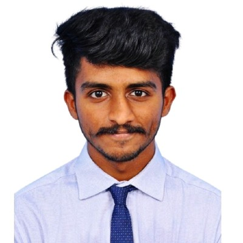

# Hey there 👋, I'm Viekash Vinoth Kumar 👨‍💻

### ●'◡'●

I am a funded master's student in Robotics at Carnegie Mellon School of Computer Science, specializing in Computer Vision, Deep Learning and Machine Learning. My unwavering commitment to solving complex industrial Artificial Intelligence-powered automation challenges, coupled with a strong desire to democratize affordable and accessible technology, drives career aspirations in my speciality upon graduation in May 2024. To gain relevant experience and further hone my skills, I am actively seeking an internship opportunity for summer 2023.

- 💬 **Ask me about:** Anything tech
- 📫 **How to reach me:** Drop a mail
- ⚡ **Fun fact:** Most people pronounce my first name wrong. Give it a try 🙃
- ♟ **Hobbies:** Chess, Athletics and Music

    <samp>
        <!--   -->
        <a href="https://www.linkedin.com/in/viekash-v-k/">｢ LinkedIn ｣</a> .
        <a href="mailto:vvinothk@andrew.cmu.edu">｢ Email ｣</a> .
        <a href="https://scholar.google.com/citations?user=P9ZYvMYAAAAJ&hl=en">｢ Google Scholar ｣</a> .
        <a href="https://www.youtube.com/channel/UCH5-jDMnHteogaP73q_krkQ">｢ Youtube ｣</a> .
         
         
    </samp>

## ᓚᘏᗢ

